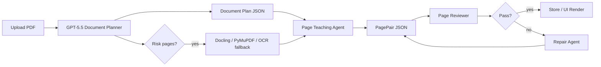

# 稳定高效的课程 PDF Agent 框架

## 核心选择

当前最优路线应调整为：

**GPT-5.5 direct PDF understanding + deterministic PagePair workflow + local parser fallback**

也就是说，GPT-5.5 可以作为主模型直接读取 PDF，但系统不能把“整份 PDF 丢给模型一次性生成所有页讲解”当作唯一流程。稳定高效的关键是把模型能力放进可控 Agent 框架里：

1. **Document Planning Agent**：读取整份 PDF，生成课程结构、页码范围、章节树、术语表和风险页。
2. **Page Teaching Agent**：按页生成讲解，每次只生成一页或小批量页面，输出严格 JSON。
3. **Page Reviewer Agent**：检查页码对齐、幻觉、空页、公式/图表解释是否缺失。
4. **Repair Agent**：只修复失败页面，不重跑整份文档。
5. **Fallback Parser**：当 PDF 直读页码不稳定、扫描质量差或需要缓存时，启用 Docling/PyMuPDF/MinerU 生成 Page JSON。

## 为什么不是单次大 Prompt

GPT-5.5 直读 PDF 能省掉大量解析胶水，但单次生成整本课程有三个风险：

- **页级对齐风险**：模型可能合并相邻页、漏页、或把图表解释归到错误页。
- **重试成本高**：第 37 页失败时，不应该重跑前 36 页。
- **审计困难**：无法判断错误来自 PDF 视觉读取、文本理解，还是讲解生成。

所以推荐主流程是“两阶段 + 页级闭环”：

## 推荐模型调用方式

### 在线交互

- 模型：`gpt-5.5`
- API：Responses API
- 输入：PDF file input + prompt config + optional page range
- 输出：严格 JSON Schema
- 用途：上传后快速生成前几页、用户校对、单页重跑

### 离线批处理

- 模型：`gpt-5.5` 或成本更低的同族模型
- API：Batch API
- 输入：按页或按章节拆分的 requests
- 输出：`lecture_pairpack.v1.jsonl`
- 用途：整门课程、夜间批量任务、大文件

## GPT-5.5 直读 PDF 的输入策略

优先使用 PDF 作为 `input_file`，但 prompt 必须显式要求：

- 保留源 PDF 页码，不允许重新编号。
- 不确定页码或内容时输出 `needs_parser_fallback: true`。
- 对空页、目录页、习题页、图表页分别标记 `page_type`。
- 每页输出 `confidence` 和 `evidence`。
- 严格遵循 JSON Schema，不输出解释性散文。

示例请求骨架见 [examples/gpt55-responses-pdf-request.json](/Users/harry/PDF_Agent/examples/gpt55-responses-pdf-request.json)。

## 稳定性机制

1. **Schema-first**：所有模型输出先过 JSON Schema，再进入 UI。
2. **Page hash cache**：缓存 key 使用 `document_id + page_no + prompt_version + model`。
3. **Small batch window**：默认每批 1 到 5 页，超过 5 页只做规划不做最终讲解。
4. **Reviewer gate**：低于置信度阈值或 evidence 缺失的页面进入 repair。
5. **Fallback trigger**：当页码错乱、表格/公式缺失、扫描页不清晰时，切换本地解析器。
6. **Prompt versioning**：prompt 配置写入结果元数据，方便复现。

## 产物格式

主产物仍然是：

**`lecture_pairpack.v1.json`**

它比讲解 PDF 更适合 Agent 框架，因为它支持：

- 单页重跑；
- 结构化审校；
- UI 左右对照；
- Markdown/PPTX/TTS 二次导出；
- 缓存和 diff。

## Prompt 与 Schema 文件

- Prompt 配置：[prompts/course-agent.config.yaml](/Users/harry/PDF_Agent/prompts/course-agent.config.yaml)
- 输出 Schema：[schemas/lecture_pairpack.schema.json](/Users/harry/PDF_Agent/schemas/lecture_pairpack.schema.json)
- 页级批处理 Schema：[schemas/lecture_pairpack.page_batch.schema.json](/Users/harry/PDF_Agent/schemas/lecture_pairpack.page_batch.schema.json)
- GPT-5.5 PDF 请求示例：[examples/gpt55-responses-pdf-request.json](/Users/harry/PDF_Agent/examples/gpt55-responses-pdf-request.json)

## 官方资料依据

- 最新模型页面当前给出 `gpt-5.5`：<https://developers.openai.com/api/docs/guides/latest-model.md>
- PDF file input：<https://developers.openai.com/api/docs/guides/pdf-files>
- Responses API：<https://developers.openai.com/api/reference/resources/responses/methods/create>
- Structured Outputs：<https://developers.openai.com/api/docs/guides/structured-outputs>
