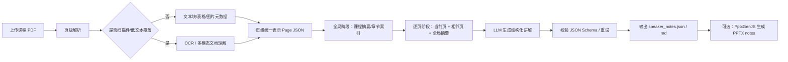
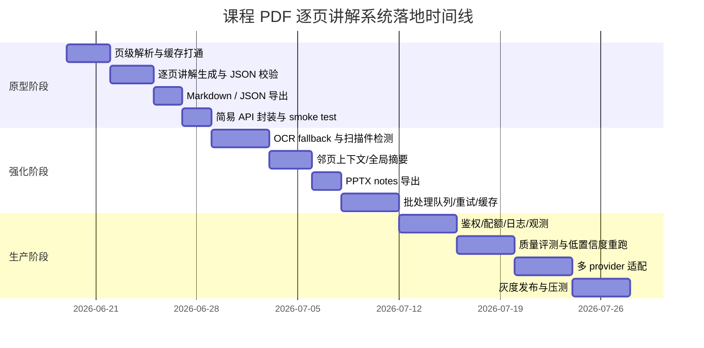

# 课程 PDF 逐页讲解 Slides Agent 框架深度调研报告

## 执行摘要

你要的其实不是“普通 PDF 摘要器”，而是一个**面向课件理解的批处理 agent 系统**：输入课程 PDF，按页抽取文本、图表、公式与版面信息，再为每一页生成对应的讲解稿，最后输出为 speaker notes、Markdown，或者直接生成 PPTX。这个目标里，**页级对齐**、**扫描件/OCR**、**图文混排理解**、**长上下文控制**、**批处理吞吐**、**API 化编排**才是真正的难点，而不是单次“让 LLM 总结 PDF”。官方文档和开源仓库显示，市面上已经有几类可用方案：一类是通用 agent/framework 编排层，如 LangGraph、LlamaIndex、Haystack、Dify、OpenAI Agents SDK、Semantic Kernel；另一类是更接近成品的“文档到幻灯片”系统，如 PPT Master、Paper2Slides。前者更适合做你要的“逐页讲解 + API 服务 + 可控批处理”，后者更适合快速出一个能看的 deck。citeturn1search0turn13search2turn1search4turn1search5turn4search13turn8view0turn10view0

如果你要我先给一个不绕弯的结论：**最推荐的参考实现是 LangGraph + Docling/MinerU + PyMuPDF 渲染 + 可切换 LLM Provider + PptxGenJS 导出**。原因很简单：它在“逐页可控、可做 API、可批量、可缓存、可替换模型、可本地部署”这几个维度上最均衡。若你更看重**复杂 PDF 解析精度**而不是本地可控性，那么 **LlamaIndex + LlamaParse** 是非常强的托管路线；若你希望**首版最快落地、最好上手、且喜欢可视化编排**，**Dify Workflow + Knowledge Pipeline + MinerU 插件**是最省开发力的路径；若你已经全栈在微软生态里，**Semantic Kernel + Azure Document Intelligence** 会更顺手、更 enterprise。至于**PPT Master** 和 **Paper2Slides**，它们已经非常接近“现成能用”的文档到演示稿系统，但更像“成品项目/工作流”，不如前面几套适合作为你自己的 API 产品底座。citeturn5search1turn5search0turn3search5turn3search4turn5search3turn2search8turn15search2turn5search16turn4search13turn16search2turn8view2turn10view0

还有一个关键判断：**没有哪个现成框架会完美满足“一个 PDF 页对应一个 slide 的讲解，并且长期稳定 API 化可批处理”**。最接近的现成项目是 PPT Master 和 Paper2Slides，但如果你要的是“课程 PDF 丢进去，稳定逐页生成讲解，后续还能挂在你自己的后端接口里”，那就应该把“文档解析”和“讲解生成”拆开，再用 agent framework 串起来，而不是试图押宝某个一体化黑盒。这个判断是基于各项目官方能力边界做出的工程结论。citeturn8view2turn10view0turn1search5turn4search1

## 需求拆解与技术路径

“逐页生成对应讲解”这个需求，看着像一句话，实际上是一个多阶段流水线。PDF 可能是数字文本，也可能是扫描件；一页里可能有段落、表格、公式、图片、坐标轴图、手写批注；讲解稿又不能只机械复述当前页，因为很多老师的 slide 会把定义放前一页、例子放后一页。于是，一个靠谱系统至少要有六层能力：**页级抽取**、**OCR/图像理解**、**版面分析与阅读顺序恢复**、**页级上下文拼装**、**LLM 结构化生成**、**导出为 notes/slides**。PyMuPDF 可以做高性能文本/块级抽取，并支持接入 Tesseract OCR；Docling、MinerU、Unstructured、Azure Document Intelligence、LlamaParse 都强调对布局、表格、阅读顺序、OCR 或 Markdown/JSON 导出的支持，这些能力正是做“逐页讲解”时最值钱的部分。citeturn3search0turn5search6turn5search14turn5search1turn5search5turn5search0turn3search1turn16search2turn5search3



如果按“组件选型”来拆，推荐这样理解。**第一层 PDF 解析**：轻量文本型 PDF 用 PyMuPDF 足够快，但官方文档也明确提醒，纯文本抽取未必自动恢复自然阅读顺序；复杂布局更适合 Docling、MinerU、Unstructured、LlamaParse 或 Azure DI 这类布局感知型解析器。**第二层 OCR 与图像转文本**：PyMuPDF 可调用 Tesseract；MinerU 会自动检测扫描/乱码 PDF 并开启 OCR，还宣称支持 109 种语言；Mistral OCR、Azure DI、Google Gemini 文档理解、Claude PDF support 都支持直接处理 PDF 或含图页面；Mathpix 则特别适合公式密集的 STEM 课件。**第三层分块与上下文**：你的“块”不该是固定 token chunk，而应该是 `page -> block -> figure/table/formula` 三层；生成每页讲解时，主输入是当前页，辅输入是上一页摘要、下一页标题、全局课程摘要。这样既保持页级对齐，又能避免模型“只看这一页”造成断章取义。citeturn3search0turn5search14turn5search1turn5search0turn3search11turn6search0turn6search5turn16search2turn20search0turn11search3

从 LLM 集成角度看，存在三种主流模式。第一种是**代码式 agent orchestration**：LangGraph、Haystack、Semantic Kernel、OpenAI Agents SDK 这类框架自己管理 state、tool、handoff、重试与会话。第二种是**RAG-first 数据编排**：LlamaIndex、Dify Knowledge Pipeline 更强调“文档进来后如何被解析、索引、检索、再喂给生成模型”。第三种是**成品型 agent 工作流**：PPT Master、Paper2Slides 已经把“从文档到幻灯片”的很多默认策略内置好了。对你的场景，最稳的做法通常不是“整份 PDF 直接丢给模型”，而是“先页级实体化，再让 agent 逐页调用 LLM”，因为你要的是**稳定批处理和可复用 API**，不是一次性 demo。官方文档也能看出，OpenAI、Gemini、Claude 都支持大上下文或 PDF/file input，但这更适合做全局索引与跨页辅助，不应替代页级控制本身。citeturn1search0turn16search3turn16search0turn4search13turn1search5turn13search19turn15search2turn12search2turn20search0turn11search3

## 候选框架与产品对比

下面这张表里，**许可/成本、语言/平台、功能**来自官方文档或仓库；**部署复杂度、扩展性、时延等级**是基于依赖路径与运行方式给出的工程评估，不是厂商 SLA。

| 候选 | 类型 | 许可/成本 | 语言/平台 | 逐页讲解适配度 | 部署复杂度 | 隐私/数据处理 | 适合场景 | 来源 |
|---|---|---|---|---|---|---|---|---|
| LangGraph + Docling/PyMuPDF + PptxGenJS | 开源组合栈 | LangGraph MIT；Docling MIT；PptxGenJS MIT；模型成本自选 | Python + Node.js | 很高，最容易强制一页一结果 | 中高 | 可做到本地解析；模型是否出网取决于你选的 provider | 自建 API 产品、强控制、可维护 | citeturn1search0turn13search0turn5search1turn3search5turn4search0 |
| LlamaIndex + LlamaParse | 混合型 | LlamaIndex 开源；LlamaParse 按 credit/page 计费，官方给出 $1.25 / 1000 credits 等价格与并发档位 | Python / TypeScript + 托管服务 | 很高，官方 SDK 直接返回 `markdown.pages[i]` | 中 | 文档发送到 LlamaParse 云端，企业版能力另论 | 复杂 PDF、表格/图表/手写密集、想要省事 | citeturn13search19turn17search11turn5search3turn2search8turn2search2 |
| Haystack + DoclingConverter / AzureOCR | 开源组合栈 | Haystack Apache 2.0；转换器可本地或接外部服务 | Python | 高，但要自己设计页级 pipeline | 中 | 本地或混合部署都行 | 需要透明 pipeline、评测、可插拔检索/路由 | citeturn13search2turn13search14turn1search9turn16search0 |
| Dify Workflow + Knowledge Pipeline + MinerU | 开源平台 + 插件 | Dify 开源许可基于 Apache 2.0 带附加条款；Cloud 有官方价格；自托管可用 Docker Compose；MinerU 开源许可基于 Apache 2.0 变体 | 平台化，低代码，API 可调用 | 中高，取决于你如何在 workflow 中保留 page id | 中 | 可自托管；Cloud 则数据进 Dify/外部模型 | 首版快、可视化编排、中文团队协作 | citeturn13search3turn2search4turn15search2turn18view0turn5search16turn5search0 |
| OpenAI Agents SDK + Responses API + 自定义解析工具 | 开源 SDK + 商业 API | SDK 开源；模型按 token 计费；Batch 官方说明可降 50% 成本 | Python / TypeScript | 高，但 PDF/layout 解析最好不要只靠模型裸吃 | 中 | 文件/请求进 provider；API 功能成熟 | 结构化输出、工具调用、批处理任务 | citeturn1search5turn19search7turn19search0turn19search4turn14search2turn11search0 |
| Semantic Kernel + Azure Document Intelligence | 开源 SDK + 商业云服务 | SK MIT；Azure DI 按页计费，官方价格页列出了不同模型价格 | C# / Python / Java + Azure | 高，尤其适合企业文档流程 | 中高 | Azure 托管，易融入现有 Azure 治理体系 | 微软栈、企业合规、异步文档分析 | citeturn4search13turn4search2turn16search2turn17search7turn2search5 |
| PPT Master | 开源成品型 agent 系统 | MIT；外部模型/图像/TTS 成本自选 | Python + 任意带 agent 能力的 IDE/CLI | 中高，可生成 notes 和 PPTX，但页级映射需提示或改造 | 中 | 本地文件处理 + 外部模型提供商 | 想快速从 PDF 直接出可编辑 PPTX | citeturn8view0turn9view1turn8view2turn8view1 |
| Paper2Slides | 开源成品型系统 | MIT；外部 API key 自备；支持 `--parallel` | Python + Web/CLI | 中，偏“文档到演示稿”，不是严格页对页教学讲解器 | 中 | 文档本地流程 + 外部模型 | 快速试做 paper/report → slides | citeturn10view0 |

补一句很关键的判断：如果你要做的是**“产品级 API 服务”**，上面最稳的是前三到前六类；如果你要的是**“先跑起来看看效果”**，PPT Master 和 Paper2Slides 的上手速度会更诱人。最近学术方向里，PPTAgent 这类工作已经把“幻灯片生成”明确当成 agentic editing 问题来做，说明这条路线本身是成立的，但研究项目和你的工程需求之间还差很长一段“服务化、稳定化、页级约束化”。citeturn7search3turn7search6turn8view3

## 重点候选方案拆解

**LangGraph 组合栈**  
许可/成本：LangGraph 是 MIT，Docling 是 MIT，PptxGenJS 是 MIT；如果你用 PyMuPDF，本地抽取几乎零边际成本，真正的持续成本主要来自 LLM API 和可选 OCR。语言/平台：Python 负责编排，Node.js 负责把 notes 写进 PPTX。依赖：LangGraph、Docling 或 PyMuPDF、可选 Tesseract、PptxGenJS。强项在于 stateful agent orchestration 很适合做“逐页 DAG”：`parse_page -> enrich_context -> generate_notes -> validate -> export`，而且你可以强制 state 里带 `page_no`、`ocr_mode`、`neighbor_summary`，从而避免模型在长任务里漂移。短板也很明确：这不是现成一体机，很多胶水代码要你自己写。工程评估上，它的部署复杂度中高，但扩展性最高；文本型 PDF 延迟通常最低，扫描件或多模态页会明显变慢；隐私最好，因为解析层完全可本地化。citeturn1search0turn17search1turn5search17turn5search1turn3search5turn5search6turn4search0turn3search4

以下是这种栈的最小形态示意，重点是把 `page_no` 当成一等公民，而不是先切 token 再丢失页边界：

```python
from typing import TypedDict, List, Dict
import fitz
from langgraph.graph import StateGraph, END

class S(TypedDict):
    pdf_path: str
    pages: List[Dict]
    doc_summary: str
    results: List[Dict]

def parse_pdf(state: S):
    doc = fitz.open(state["pdf_path"])
    pages = []
    for i, page in enumerate(doc):
        pages.append({
            "page_no": i + 1,
            "text": page.get_text("text"),
            "blocks": page.get_text("blocks"),
        })
    return {"pages": pages}

def build_doc_summary(state: S):
    joined = "\n\n".join(p["text"][:2000] for p in state["pages"][:8])
    summary = llm_summarize(joined)   # 你自己的 LLM 调用
    return {"doc_summary": summary}

def generate_per_page(state: S):
    out = []
    for i, p in enumerate(state["pages"]):
        neighbor = {
            "prev": state["pages"][i-1]["text"][:800] if i > 0 else "",
            "next": state["pages"][i+1]["text"][:800] if i + 1 < len(state["pages"]) else "",
        }
        note = llm_note(page=p, neighbor=neighbor, doc_summary=state["doc_summary"])
        out.append({"page_no": p["page_no"], "speaker_notes": note})
    return {"results": out}

g = StateGraph(S)
g.add_node("parse_pdf", parse_pdf)
g.add_node("build_doc_summary", build_doc_summary)
g.add_node("generate_per_page", generate_per_page)
g.set_entry_point("parse_pdf")
g.add_edge("parse_pdf", "build_doc_summary")
g.add_edge("build_doc_summary", "generate_per_page")
g.add_edge("generate_per_page", END)
app = g.compile()
```

**LlamaIndex + LlamaParse**  
这套是“少造轮子”的典型选项。LlamaIndex 本身是开源数据编排框架，支持 agents 与 RAG；LlamaParse 则是它的托管型 agentic OCR / document parsing 产品，官方 Quickstart 明确展示了上传文件后直接拿 `result.markdown.pages[0].markdown` 的用法，定价和并发档位也公开，说明它非常自然地适合“页级抽取 → 页级讲解生成”。栈上你通常只需要补两件事：一是讲解稿生成 prompt；二是导出层。工程评估：部署复杂度低到中；扩展性高，因为解析并发由托管服务承担；时延中等，主要耗在 parse job；隐私上要接受文档进云。它对“复杂扫描件、表格、图表、混排文档”的适配度，是当前官方产品里最强的一档之一。citeturn13search19turn5search3turn5search11turn17search15turn2search8turn2search2

```python
from llama_cloud_services import LlamaParse
from openai import OpenAI

parser = LlamaParse(api_key="LLAMA_CLOUD_API_KEY")
docs = parser.load_data("lecture.pdf")  # 高层封装
# 如果用新版 Llama Cloud SDK，则可直接读 result.markdown.pages[i].markdown

client = OpenAI()

page_markdowns = [d.text for d in docs]  # 视 SDK 而定，示意
results = []
for i, md in enumerate(page_markdowns, start=1):
    prompt = f"""你是课程讲师。请为第{i}页生成中文讲解：
- 先解释本页核心概念
- 再说明图表/公式含义
- 最后给出和前后页的衔接
输入页内容：
{md}
"""
    resp = client.responses.create(
        model="gpt-5.4-mini",
        instructions="输出简洁但可直接作为 speaker notes 使用。",
        input=prompt,
    )
    results.append({"page_no": i, "speaker_notes": resp.output_text})
```

**Haystack 组合栈**  
Haystack 的定位是开源 AI orchestration framework，强调模块化 pipeline、agent、toolset、routing。官方文档里既有 PDF 转换组件，也有 Agent、Agentic Pipelines、PipelineTool 这些概念，所以它很适合“文档解析器 + 检索器 + 生成器 + 校验器”这种白盒流程。它的优势不是最短上手路径，而是**透明、可测试、可评估**。如果你后面希望做“页级讲解质量评测”“只对低置信度页重跑”“把整页 pipeline 作为 tool 再挂给更高层 agent”，Haystack 的架构会很舒服。工程评估：部署复杂度中等；扩展性高；延迟取决于你用本地转换器还是外部 OCR；隐私也能控制在本地。短板是 PPTX 导出与 UI 不是它的强项。citeturn13search2turn16search3turn16search0turn16search15turn1search9

```python
from haystack import Pipeline
from haystack.components.converters import PyPDFToDocument
from haystack.components.generators import OpenAIGenerator

pipe = Pipeline()
pipe.add_component("pdf", PyPDFToDocument())
pipe.add_component("llm", OpenAIGenerator(model="gpt-5.4-mini"))

docs = pipe.get_component("pdf").run(sources=["lecture.pdf"])["documents"]

results = []
for d in docs:
    page_no = d.meta.get("page_number", None)
    prompt = f"为这一页课件写中文讲解稿，直接给 speaker notes。\n\n{d.content}"
    out = pipe.get_component("llm").run(prompt=prompt)
    results.append({
        "page_no": page_no,
        "speaker_notes": out["replies"][0]
    })
```

**Dify Workflow + Knowledge Pipeline + MinerU**  
如果你的目标是“尽快做出能上传 PDF、能跑批、能从前端触发的东西”，Dify 很有吸引力。官方中文文档已经把它定位成可视化 agentic workflow builder，而且工作流、知识流水线、工具节点、HTTP 请求节点、代码节点、工作流 API 都是开箱即用的。你可以把 `用户上传文件` 作为输入，把 MinerU 插件或外部解析 API 放进工作流里，再用代码节点把页数据整理成数组，然后让 LLM 节点逐页生成，最后通过 `POST /workflows/run` 暴露给前端或你自己的后端调用。官方 API 还支持 blocking / streaming 和 run detail 查询。工程评估：部署复杂度中等，自托管门槛不高；可扩展性对中小团队已经够用；但如果你要极度确定的页循环、细粒度缓存、复杂 fallback 分支，纯 workflow 体验会不如代码框架丝滑。citeturn1search4turn15search1turn15search2turn15search6turn15search10turn18view0turn18view1turn18view2turn18view3turn5search16turn5search0

一个典型的 API 触发方式如下，适合把“单个 PDF → 一组页级 notes”封成服务：

```bash
curl --request POST \
  --url https://YOUR_DIFY_BASE/v1/workflows/run \
  --header 'Authorization: Bearer YOUR_API_KEY' \
  --header 'Content-Type: application/json' \
  --data '{
    "inputs": {
      "pdf_file": [
        {
          "type": "document",
          "transfer_method": "upload_file_id",
          "upload_file_id": "FILE_ID_FROM_UPLOAD"
        }
      ]
    },
    "response_mode": "blocking",
    "user": "course_pdf_user_001"
  }'
```

工作流内部建议做成：`文件输入 -> HTTP/Tool(MinerU) -> Code(转成 pages[]) -> LLM(逐页) -> End`。如果讲解过长或文档很大，用 streaming 或异步轮询 run detail 会更稳。citeturn18view0turn18view1

**OpenAI Agents SDK + Responses API + 自定义解析工具**  
OpenAI 官方现在把 Agents SDK 定义为代码式 agent 编排层，Responses API 则是更通用的生成接口，支持 text/image input、file inputs、内建 tools 与 function calling，还有 Structured Outputs 保证 JSON Schema。对于你的场景，这意味着你完全可以自己写 `extract_page(page_no)`、`ocr_page(page_no)`、`get_neighbor_summary(page_no)` 这几个工具，然后让 agent 按页调用；或者更直接一点，你自己管理页循环，只把每页内容送进 Responses API 生成结构化 notes。它最大的优势不是“PDF 解析最强”，而是**结构化输出、工具使用、批处理、速率限制治理都很成熟**。官方 Batch API 还明确给出 50% 成本下降、独立更高额度、24 小时内完成的批处理模式，这对“整门课几十份 PDF 夜间批量预处理”很香。工程评估：复杂度中等；扩展性高；隐私取决于你把多少内容直接发给 provider；若你只需要页级 notes，它非常好用，但如果 PDF 版面复杂，最好前面仍接 Docling/MinerU/LlamaParse 之类解析器。citeturn1search5turn19search0turn19search4turn14search2turn11search0turn11search1turn12search2turn12search5

```python
from openai import OpenAI
client = OpenAI()

schema = {
    "name": "page_note",
    "schema": {
        "type": "object",
        "properties": {
            "page_no": {"type": "integer"},
            "title": {"type": "string"},
            "speaker_notes_md": {"type": "string"},
            "keywords": {"type": "array", "items": {"type": "string"}}
        },
        "required": ["page_no", "title", "speaker_notes_md", "keywords"],
        "additionalProperties": False
    }
}

def gen_note(page_no: int, page_text: str, prev_summary: str, next_hint: str):
    return client.responses.create(
        model="gpt-5.4-mini",
        instructions="你是高校课程助教，输出中文、可直接朗读的讲解。",
        input=f"""
当前页编号：{page_no}
上一页摘要：{prev_summary}
下一页提示：{next_hint}
当前页内容：
{page_text}
""",
        text={"format": {"type": "json_schema", "name": schema["name"], "schema": schema["schema"]}}
    )
```

**Semantic Kernel + Azure Document Intelligence**  
如果你在微软生态，尤其是后端是 .NET/Azure，这套会非常顺手。Semantic Kernel 是 MIT、支持 C#/Python/Java，官方把它定义为 model-agnostic 的 agent/multi-agent SDK，插件/函数调用体系也很成熟。Azure Document Intelligence 的 layout model 则是标准的文档分析服务，官方强调能提取文本、表格、选择标记和文档结构，并且是异步分析 API。两者结合后，你可以把“分析 PDF 页面”“获取结构化布局结果”“生成讲解稿”“写入存储”分别实现成 plugin/function，再由 SK agent 或工作流驱动。工程评估上，它的复杂度偏中高，但企业治理、身份、审计、异步任务管理会比普通开源拼装更省心。缺点就是 Azure 绑定更强，原型速度通常不如 Dify 或 LangGraph。citeturn4search13turn4search1turn16search1turn16search7turn16search2turn17search7turn16search8turn2search5

```csharp
// 伪代码，展示职责拆分
var kernel = Kernel.CreateBuilder()
    .AddOpenAIChatCompletion("gpt-5.4-mini", apiKey)
    .Build();

kernel.Plugins.AddFromFunctions("PdfTools", new[]
{
    KernelFunctionFactory.CreateFromMethod(AnalyzeLayoutAsync),   // Azure DI
    KernelFunctionFactory.CreateFromMethod(GeneratePageNoteAsync) // LLM
});

var agent = new ChatCompletionAgent
{
    Name = "CourseSlideExplainer",
    Instructions = """
    对 PDF 逐页处理：
    1. 调用 AnalyzeLayoutAsync 获取 page-level 结构
    2. 为每一页生成中文讲解稿
    3. 输出 page_no, title, speaker_notes
    """
};
```

**PPT Master**  
这是目前非常值得认真看的“成品型”开源项目。它不是一般意义上的 PDF RAG 框架，而是“AI 生成原生可编辑 PPTX”的 agent 系统。官方仓库与技术设计文档写得很清楚：文档先被转成结构化文本，Strategist 规划设计，Executor 生成每页 SVG，再经过后处理变成真正的 DrawingML/PPTX；与此同时，它会生成完整 `notes/total.md`，然后再拆分 notes，最后导出 PPTX，而且官方 Getting Started 还专门提到 narration 会把每页 speaker notes 变成音频。这意味着它已经天然覆盖了你需求里“slides + speaker notes”这半边。工程上，它最大的优点是“结果很像正经产物”，最大的不足是它围绕 coding agent 工作，而不是天然给你一个干净简洁的后端 API。所以拿来直接用很爽，拿来当 API 产品内核则常常需要再包装一层。citeturn8view0turn9view1turn8view1turn8view2

一个非常实用的起步方式是直接把它当“可控的 agent skill”来使用，再逐渐把其中的解析、notes、导出脚本抽成服务：

```bash
git clone https://github.com/hugohe3/ppt-master.git
cd ppt-master
pip install -r requirements.txt

# 然后在支持 agent 的 IDE/CLI 里下任务：
# Please create a PPT from projects/course/lecture01.pdf
# One source page should map to one slide where possible.
# Put the explanation for each page into speaker notes in Chinese.
```

如果你只想复用它的 notes / PPTX 导出阶段，可以重点看它的 `notes/total.md`、`total_md_split.py` 和 `svg_to_pptx.py` 这一段流水线。citeturn8view2turn8view1

**Paper2Slides**  
Paper2Slides 也是很值得试的一体化系统。它更偏“研究论文/报告到演示稿”，但官方 README 已经明确写了四阶段 pipeline：RAG -> Analysis -> Planning -> Creation，并且支持 `--parallel` 并行生成、checkpoint/resume、Web 界面和 CLI。这很适合快速做“文档批量出 slides”的验证。对你的场景，它的优点是**上手快、batch 感比较强**；缺点是它更像“从文档提炼出讲稿和版式”的系统，不是严格面向“每一页源 PDF 对应一页讲解 notes”的教学解释器，所以如果你要很强的页级可追踪性，往往仍要改 prompt 或改 pipeline。citeturn10view0

```bash
# 基础用法
python -m paper2slides --input lecture.pdf --output slides --length medium

# 并行生成
python -m paper2slides --input lecture.pdf --output slides --length medium --parallel 2

# 快速预览
python -m paper2slides --input lecture.pdf --output slides --fast
```

如果你只是想看“现成项目能不能一下做出像样效果”，它值得试；如果你想做 API 服务，我会把它当作参考实现而不是最终底座。这个结论主要来自它官方公开的 pipeline 形态与 checkpoint 设计。citeturn10view0

## 推荐的端到端参考实现

我建议的参考实现，不是最花哨，而是**最像你后面真能上线的版本**：

- 编排层：**LangGraph**
- 本地解析主路：**Docling**
- 轻量渲染与兜底抽取：**PyMuPDF**
- 扫描件/乱码 fallback：**MinerU 本地** 或 **Mistral OCR / Azure DI**
- 公式很重的课件 fallback：**Mathpix**
- LLM 生成层：**抽象成 provider adapter**，至少支持 OpenAI / Claude / Gemini 三个接口
- 输出层：**speaker_notes.json + Markdown + 可选 PptxGenJS**
- 外部服务层：FastAPI / NestJS 暴露 API；Redis 做缓存/队列；对象存储放页图与中间 JSON；Postgres 或 SQLite 存任务元数据

这么配不是“我随手凑的”，而是因为官方能力边界很互补：Docling/MinerU 都能产出结构化 Markdown/JSON，PyMuPDF 负责快，PptxGenJS 官方支持 speaker notes，OpenAI 有 Structured Outputs 与 Batch，Claude 支持 PDF 且该功能可进入 ZDR，Gemini 则原生支持 PDF 与长上下文文件输入。把它们拆成 provider adapter，你后面就不会被单一模型锁死。citeturn5search1turn5search5turn5search0turn3search5turn5search6turn6search0turn6search5turn3search4turn14search2turn11search0turn11search3turn20search0turn20search2

我建议把整套流程分成三个阶段，而不是“一次 prompt 解决所有问题”。

第一阶段是**解析与索引**。输入 PDF 后，先生成 `document_manifest.json`，里面至少有 `page_no`、`text_md`、`blocks`、`images`、`ocr_used`、`parser_name`、`parser_version`。如果页面文本长度太低、乱码率高、或者检测到图片覆盖率很高，就自动切 OCR/fallback 路由。这个阶段的目标不是生成讲稿，而是把 PDF 变成**可验证的 Page JSON**。这样后面任何质量问题都能回溯到“解析错了”还是“生成错了”。citeturn5search1turn5search0turn3search0turn5search14

第二阶段是**两层生成**。先做一个全局调用，生成课程级摘要、章节树、重要定义表、符号表；再做逐页调用，每页输入由四部分组成：当前页结构化内容、上一页简述、下一页标题/提示、全局课程摘要。这里不要贪心把整本讲义都喂进去。官方文档确实表明 OpenAI、Claude、Gemini 都能用很长上下文，但工程上最稳的方式仍然是“**小而准的页级上下文 + 一个全局摘要**”，这样成本、延迟、重试、缓存都更可控。citeturn12search2turn12search4turn12search0turn11search4

第三阶段是**验证与导出**。讲解生成必须走结构化 JSON schema，例如：

```json
{
  "page_no": 12,
  "slide_title": "最大似然估计的几何直觉",
  "speaker_notes_md": "本页要点是……",
  "concepts": ["likelihood", "argmax", "log-likelihood"],
  "prerequisites": ["上一页的概率模型定义"],
  "visual_explanations": [
    "图中的曲线表示……"
  ],
  "confidence": 0.89
}
```

在 OpenAI 路线上，Structured Outputs 可以直接约束这个 schema；如果你换 provider，就在服务层做 JSON 校验与 repair loop。通过校验后，一份输出写成 `speaker_notes.jsonl`，另一份写成 `notes.md`，如果要导 PPTX，再交给 PptxGenJS 统一生成。citeturn14search2turn3search4

提示模板方面，我建议分成两版。解析后生成用“**教学说明型 prompt**”，而不是摘要 prompt。示意如下：

```text
系统：
你是高校课程助教。你的任务不是压缩文本，而是为每一页课件写一段可直接配音/讲课的中文讲解。
要求：
1. 先说这页在课程脉络里的位置。
2. 再解释本页标题、核心概念、公式、图表、例子。
3. 如果本页信息不足，主动利用提供的上一页摘要和全局摘要补足衔接。
4. 不要编造页面中不存在的定义或结论。
5. 输出严格遵循 JSON schema。

用户：
页号：{{page_no}}
全局课程摘要：{{doc_summary}}
上一页摘要：{{prev_summary}}
下一页提示：{{next_hint}}
当前页结构化内容：
{{page_markdown}}
```

批处理策略上，我建议这样做。**小文档在线同步、长文档离线批处理**：10 页以内、且非扫描件，可以直接同步返回；更长的课件走异步任务队列。使用 OpenAI 时，夜间离线任务可优先用 Batch API；在线任务则做常规 Responses/chat 请求，并加指数退避与 token 配额控制。缓存建议分三层：**解析缓存**（`file_sha256 + parser_version`）、**页级生成缓存**（`page_hash + model + prompt_version`）、**全局摘要缓存**（`doc_hash + summary_prompt_version`）。这样任何一层修改都不会把整条流水线重新烧一遍 token。citeturn11search0turn11search1turn18view0

如果你预算未知、部署环境未知，我的默认建议是：

- **原型期**：Docling + LangGraph + OpenAI / Gemini + speaker_notes.json
- **复杂扫描课件**：LlamaParse 或 Azure DI 替换解析层
- **公式很重的数学/物理材料**：在 fallback 路由上加入 Mathpix
- **正式版**：加 Redis 队列、MinIO/S3、中间结果可追踪、导出层接 PptxGenJS

这个路线最大的好处是：哪怕后面你想从“逐页 notes”升级到“自动生成完整课程 ppt demo、习题解析版本、双语 speaker notes、TTS 配音”，架构都不用推倒重来。citeturn6search5turn6search17turn17search11turn16search2

## 最小可复现示例

下面给你一个**真正能落地思考的 MRE**。考虑到你偏 C++，我把**最小编排示例写成 C++**：它用 Poppler 提取逐页文本，用 `libcurl` 调 OpenAI-compatible 接口，为每页生成讲解，并输出为 `speaker_notes.json`。这个示例**只覆盖“可搜索文本 PDF”**，不做 OCR；扫描件请直接切换到上面推荐的生产栈。Poppler/类 Poppler 工具链长期是 PDF 提取常用依赖，PptxGenJS 则是官方支持 speaker notes 的导出层。citeturn17search0turn3search4turn4search0

先看依赖。Linux 下可用这类包：

```bash
sudo apt-get install -y libpoppler-cpp-dev libcurl4-openssl-dev nlohmann-json3-dev
g++ -std=c++17 main.cpp -lpoppler-cpp -lcurl -o pdf_notes
```

然后是主程序。为了兼容更多“OpenAI-compatible”网关，示例走 `chat/completions` 风格；如果你直接用 OpenAI 官方，生产版建议切到 Responses API 与 Structured Outputs。

```cpp
#include <poppler/cpp/poppler-document.h>
#include <poppler/cpp/poppler-page.h>
#include <curl/curl.h>
#include <nlohmann/json.hpp>

#include <fstream>
#include <iostream>
#include <sstream>
#include <string>
#include <vector>
#include <stdexcept>

using json = nlohmann::json;

struct PageNote {
    int page_no;
    std::string page_text;
    std::string speaker_notes_md;
};

static size_t WriteCallback(void* contents, size_t size, size_t nmemb, void* userp) {
    size_t total = size * nmemb;
    auto* s = reinterpret_cast<std::string*>(userp);
    s->append(reinterpret_cast<char*>(contents), total);
    return total;
}

std::string read_all(const std::string& path) {
    std::ifstream ifs(path, std::ios::binary);
    if (!ifs) throw std::runtime_error("无法打开文件: " + path);
    std::ostringstream oss;
    oss << ifs.rdbuf();
    return oss.str();
}

std::vector<std::string> extract_pages_text(const std::string& pdf_path) {
    std::unique_ptr<poppler::document> doc(poppler::document::load_from_file(pdf_path));
    if (!doc) throw std::runtime_error("PDF 打开失败: " + pdf_path);

    std::vector<std::string> pages;
    int n = doc->pages();
    pages.reserve(n);

    for (int i = 0; i < n; ++i) {
        std::unique_ptr<poppler::page> p(doc->create_page(i));
        if (!p) {
            pages.push_back("");
            continue;
        }
        poppler::ustring txt = p->text();
        pages.push_back(txt.to_utf8());
    }
    return pages;
}

std::string post_chat_completion(
    const std::string& api_base,
    const std::string& api_key,
    const std::string& model,
    const std::string& system_prompt,
    const std::string& user_prompt
) {
    CURL* curl = curl_easy_init();
    if (!curl) throw std::runtime_error("curl 初始化失败");

    std::string response;
    std::string url = api_base + "/v1/chat/completions";

    json body = {
        {"model", model},
        {"temperature", 0.2},
        {"messages", json::array({
            {{"role", "system"}, {"content", system_prompt}},
            {{"role", "user"}, {"content", user_prompt}}
        })}
    };
    std::string payload = body.dump();

    struct curl_slist* headers = nullptr;
    headers = curl_slist_append(headers, ("Authorization: Bearer " + api_key).c_str());
    headers = curl_slist_append(headers, "Content-Type: application/json");

    curl_easy_setopt(curl, CURLOPT_URL, url.c_str());
    curl_easy_setopt(curl, CURLOPT_HTTPHEADER, headers);
    curl_easy_setopt(curl, CURLOPT_POSTFIELDS, payload.c_str());
    curl_easy_setopt(curl, CURLOPT_TIMEOUT, 120L);
    curl_easy_setopt(curl, CURLOPT_WRITEFUNCTION, WriteCallback);
    curl_easy_setopt(curl, CURLOPT_WRITEDATA, &response);

    CURLcode res = curl_easy_perform(curl);
    long http_code = 0;
    curl_easy_getinfo(curl, CURLINFO_RESPONSE_CODE, &http_code);

    curl_slist_free_all(headers);
    curl_easy_cleanup(curl);

    if (res != CURLE_OK) {
        throw std::runtime_error("HTTP 请求失败: " + std::string(curl_easy_strerror(res)));
    }
    if (http_code < 200 || http_code >= 300) {
        throw std::runtime_error("接口返回非 2xx: " + std::to_string(http_code) + "\n" + response);
    }

    auto j = json::parse(response);
    return j["choices"][0]["message"]["content"].get<std::string>();
}

int main(int argc, char** argv) {
    if (argc < 5) {
        std::cerr << "用法: " << argv[0]
                  << " <pdf_path> <api_base> <api_key> <model>\n";
        return 1;
    }

    const std::string pdf_path = argv[1];
    const std::string api_base = argv[2];
    const std::string api_key  = argv[3];
    const std::string model    = argv[4];

    curl_global_init(CURL_GLOBAL_DEFAULT);

    try {
        auto pages = extract_pages_text(pdf_path);
        std::vector<PageNote> results;
        results.reserve(pages.size());

        const std::string system_prompt =
            "你是高校课程助教。你的任务是根据课件页面内容，生成中文 speaker notes。"
            "要求："
            "1. 解释这一页的核心概念；"
            "2. 如果是公式，说明符号含义与直觉；"
            "3. 如果是图表，解释图像想表达什么；"
            "4. 输出必须是 JSON，格式为 "
            "{\"title\": string, \"speaker_notes_md\": string}。";

        for (size_t i = 0; i < pages.size(); ++i) {
            std::ostringstream user_prompt;
            user_prompt
                << "页号: " << (i + 1) << "\n"
                << "当前页文本:\n"
                << pages[i] << "\n\n"
                << "请输出 JSON，不要输出多余文字。";

            std::string raw = post_chat_completion(
                api_base, api_key, model, system_prompt, user_prompt.str()
            );

            json parsed = json::parse(raw);
            results.push_back(PageNote{
                static_cast<int>(i + 1),
                pages[i],
                parsed.value("speaker_notes_md", "")
            });

            std::cerr << "[OK] page " << (i + 1) << "\n";
        }

        json out = json::array();
        for (const auto& r : results) {
            out.push_back({
                {"page_no", r.page_no},
                {"page_text", r.page_text},
                {"speaker_notes_md", r.speaker_notes_md}
            });
        }

        std::ofstream ofs("speaker_notes.json");
        ofs << out.dump(2);
        ofs.close();

        std::ofstream md("speaker_notes.md");
        for (const auto& r : results) {
            md << "# 第 " << r.page_no << " 页\n\n";
            md << r.speaker_notes_md << "\n\n";
        }
        md.close();

        std::cerr << "输出已写入 speaker_notes.json / speaker_notes.md\n";
    } catch (const std::exception& e) {
        std::cerr << "错误: " << e.what() << "\n";
        curl_global_cleanup();
        return 2;
    }

    curl_global_cleanup();
    return 0;
}
```

这个 MRE 的优点是简单直给，缺点也很明显：没有 OCR、没有页图像、没有相邻页上下文、没有 schema repair、没有缓存和重试。所以它更像**“你的一号烟雾测试程序”**：验证接口联通、验证页级循环、验证 notes 风格。等这个通了，再升级成生产版引用实现。

如果你希望把上面的 JSON 再导出成真正带 speaker notes 的 PPTX，可以用一个超薄的 Node.js 导出器。PptxGenJS 官方文档明确支持 `slide.addNotes()`。citeturn3search4turn4search4

```javascript
// export_pptx.js
const fs = require("fs");
const PptxGenJS = require("pptxgenjs");

const notes = JSON.parse(fs.readFileSync("speaker_notes.json", "utf8"));
const pptx = new PptxGenJS();
pptx.layout = "LAYOUT_WIDE";
pptx.author = "Course PDF Explainer";

for (const item of notes) {
  const slide = pptx.addSlide();
  slide.addText(`第 ${item.page_no} 页讲解`, {
    x: 0.7, y: 0.5, w: 11.0, h: 0.6, fontSize: 24, bold: true
  });
  slide.addText("这里可以后续放该页截图、标题或提炼后的要点。", {
    x: 0.8, y: 1.5, w: 10.5, h: 3.0, fontSize: 18
  });
  slide.addNotes(item.speaker_notes_md || "");
}

pptx.writeFile({ fileName: "lecture_notes.pptx" });
```

如果你想把“原 PDF 每页缩略图也塞进 slide 正文”一起做，生产版建议改成：先用 PyMuPDF 或 Poppler 渲染出每页 PNG，再让 PptxGenJS `addImage()` 把每页图塞进对应 slide，speaker notes 继续沿用本示例的 JSON 即可。这样就很接近你最初想要的“课程 PDF 丢进去，自动生成逐页讲解版 slides”。citeturn3search10turn5search18turn4search4

## 原型与生产计划

下面给一个尽可能现实的工程时间线。这个是**工程估算**，不是官方承诺。



如果只做**prototype**，一个有经验的个人开发者或双人小组，通常 **1 到 2 周**就能做出“上传 PDF、逐页生成 notes、返回 JSON/Markdown、支持几十页文档”的版本。这里最少要做的事情有：页级抽取、一个全局摘要调用、逐页 notes 生成、基本错误处理、简单 API。若你选 Dify，这个时间还能再压；若你选 LangGraph + 本地解析器，首周会更扎实。这个判断基于各框架当前成熟度和文档可用性。citeturn15search7turn1search0turn19search7

如果要做到**production-ready**，我更现实的估计是 **4 到 8 周**。原因不在“生成讲解”本身，而在下面这些边角料特别容易咬人：
- 扫描件、乱码 PDF、表格页、纯图片页的 fallback；
- API Rate Limit、批处理调度、缓存失效逻辑；
- page-level traceability，也就是你后面调 bug 时能不能知道哪一页错、错在解析还是生成；
- 导出产物的一致性，例如 notes 与 slide 顺序是否永远一致；
- 隐私要求，如果要支持本地部署与云部署双模式，配置复杂度会明显上升。  
这些痛点，官方文档都从不同角度证明了：文档解析本来就有 OCR、布局、表格、结构化输出等复杂分支；agent 框架本来就要处理 tool、state、timeout、批量/流式执行。citeturn5search6turn16search2turn18view0turn11search1turn1search0turn4search1

在人员配置上，我建议：
- **原型**：1 名后端/算法工程师就够；
- **准生产**：1 名后端 + 1 名前端/平台工程 + 兼职产品/测试；
- **正式生产**：如果要支持多课程、多用户、多 provider、多导出格式，再补 1 名平台/DevOps 最稳。  
如果你问我“哪条路线最适合你现在就开干”，答案依旧很明确：**先做 LangGraph + Docling/PyMuPDF + OpenAI-compatible API + JSON notes 输出**；只要这个跑通，你再决定是不是加 Dify 可视化前台、是不是接 PptxGenJS、是不是把复杂 PDF 切给 LlamaParse/Azure DI。这个顺序最不容易把你自己绕进去。