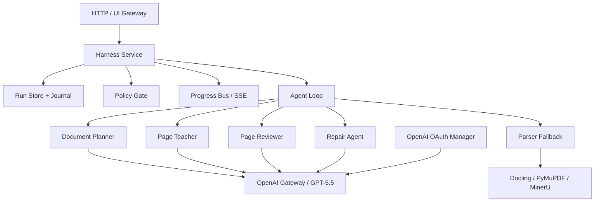

# Industrial Agent Harness Architecture

## 目标

这个项目的核心应当是一个稳定、可恢复、可观测的 agent harness，而不是一个“大 prompt + PDF 上传”的薄包装。GPT-5.5 直读 PDF 是模型能力，harness 才是工业级产品能力。

借鉴 `/Users/harry/claude-code-main` 的结论：

- 用端口协议隔离模型、解析器、存储、权限、日志，而不是在主循环里直接 import 具体服务。
- 每个长任务都有 run/task 生命周期、abort signal、progress event 和 journal。
- 子 agent 是隔离任务，不是普通函数调用。
- 所有模型输出先过 schema，再进入状态存储和 UI。
- 失败页降级为 `needs_review` 或 `needs_parser_fallback`，不让单页失败杀死整份文档。

## 分层

## 借鉴但裁剪

借鉴：

- `WorkflowPorts` 风格的端口注入。
- `JournalEntry` 风格的 deterministic resume。
- `ProgressEvent` 风格的 UI 可订阅事件。
- `TaskRegistrar` 风格的 run/task 生命周期。
- per-run semaphore 和预算闸门。
- agent dead 后重试一次，再降级。

不照搬：

- 通用 shell/file edit 工具。
- TUI/React Ink 渲染体系。
- MCP/plugin/remote bridge 大体系。
- user-authored workflow script sandbox。
- git worktree 作为默认隔离方式。

## 当前落地文件

- [src/pdf_agent/harness/agent_loop.py](/Users/harry/SynchroPage/src/pdf_agent/harness/agent_loop.py)
- [src/pdf_agent/harness/ports.py](/Users/harry/SynchroPage/src/pdf_agent/harness/ports.py)
- [src/pdf_agent/harness/types.py](/Users/harry/SynchroPage/src/pdf_agent/harness/types.py)
- [src/pdf_agent/harness/policy.py](/Users/harry/SynchroPage/src/pdf_agent/harness/policy.py)
- [src/pdf_agent/harness/session_store.py](/Users/harry/SynchroPage/src/pdf_agent/harness/session_store.py)
- [src/pdf_agent/auth/openai_oauth.py](/Users/harry/SynchroPage/src/pdf_agent/auth/openai_oauth.py)
- [src/pdf_agent/gateway/openai_gateway.py](/Users/harry/SynchroPage/src/pdf_agent/gateway/openai_gateway.py)
- [config/harness/course_pdf_harness.yaml](/Users/harry/SynchroPage/config/harness/course_pdf_harness.yaml)
