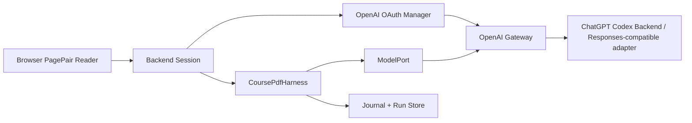

# OpenAI OAuth Gateway

## cc-switch 调研结论

subagent 已只读检查 `/Users/harry/cc-switch`。它的 Codex OAuth 不是本地 callback，而是 ChatGPT Device Code 流程：

- 后端入口：[/Users/harry/cc-switch/src-tauri/src/proxy/providers/codex_oauth_auth.rs](/Users/harry/cc-switch/src-tauri/src/proxy/providers/codex_oauth_auth.rs)
- Tauri 命令：[/Users/harry/cc-switch/src-tauri/src/commands/auth.rs](/Users/harry/cc-switch/src-tauri/src/commands/auth.rs)
- 转发前注入 token：[/Users/harry/cc-switch/src-tauri/src/proxy/forwarder.rs](/Users/harry/cc-switch/src-tauri/src/proxy/forwarder.rs)
- 前端轮询：[/Users/harry/cc-switch/src/components/providers/forms/hooks/useManagedAuth.ts](/Users/harry/cc-switch/src/components/providers/forms/hooks/useManagedAuth.ts)
- Codex Responses payload 适配：[/Users/harry/cc-switch/src-tauri/src/proxy/providers/transform_responses.rs](/Users/harry/cc-switch/src-tauri/src/proxy/providers/transform_responses.rs)
- Codex models 解析：[/Users/harry/cc-switch/src-tauri/src/services/codex_oauth_models.rs](/Users/harry/cc-switch/src-tauri/src/services/codex_oauth_models.rs)

关键流程：

1. `POST https://auth.openai.com/api/accounts/deviceauth/usercode`，只传 `client_id`，拿到 `device_auth_id` 和 `user_code`。
2. 用户打开 `https://auth.openai.com/codex/device`，输入验证码并授权。
3. 后端轮询 `https://auth.openai.com/api/accounts/deviceauth/token`，成功后拿到 `authorization_code` 和 `code_verifier`。
4. 后端向 `https://auth.openai.com/oauth/token` 换取 `access_token`、`refresh_token`、可选 `id_token`。
5. 磁盘只保存 `refresh_token` 和账号元数据；`access_token` 只放内存，到期前 60 秒刷新。
6. 调 ChatGPT Codex backend 前注入 `Authorization: Bearer <access_token>` 和 `ChatGPT-Account-Id`。
7. Responses payload 针对 Codex backend 做兼容：`store:false`、`stream:true`、`include:["reasoning.encrypted_content"]`，并去掉部分不被接受的采样字段。

这个流程没有 loopback listener、没有 browser callback、没有本地 `state` 参数，也没有本地生成 PKCE challenge。`code_verifier` 是 OpenAI device auth polling 成功后返回的字段，不能把普通 OAuth callback 模式硬套到这里。

## 已迁移到本项目的部分

本项目保留最小、可审计的后端能力，不搬 cc-switch 的完整代理系统：

- [src/pdf_agent/auth/openai_oauth.py](/Users/harry/PDF_Agent/src/pdf_agent/auth/openai_oauth.py)：Device Code login、poll、refresh、多账号、原子落盘、YAML/映射配置加载、OAuth 错误脱敏。
- [src/pdf_agent/auth/api.py](/Users/harry/PDF_Agent/src/pdf_agent/auth/api.py)：框架无关的路由 adapter，返回普通 `dict`。
- [src/pdf_agent/gateway/openai_gateway.py](/Users/harry/PDF_Agent/src/pdf_agent/gateway/openai_gateway.py)：Codex backend URL、header 注入、session header、Responses payload normalizer、models parser、占位 token guard。
- [config/auth/openai_oauth.yaml](/Users/harry/PDF_Agent/config/auth/openai_oauth.yaml)：端点、存储、originator、Responses 兼容策略、安全策略和前端 API 约定。
- [examples/auth/openai_oauth_device_login.py](/Users/harry/PDF_Agent/examples/auth/openai_oauth_device_login.py)：手动 device login 示例。
- [tests/test_openai_oauth.py](/Users/harry/PDF_Agent/tests/test_openai_oauth.py)：无网络单元测试，覆盖 refresh-only 持久化、refresh token 轮换、配置加载、错误脱敏、Codex header/payload 规则。

## 后端 API 形态

真实 Web 后端只需要把 manager 方法挂到路由：

```http
POST   /auth/openai/start
POST   /auth/openai/poll
GET    /auth/openai/status
DELETE /auth/openai/accounts/:account_id
POST   /auth/openai/default
POST   /auth/openai/logout
```

推荐映射：

- `POST /auth/openai/start` -> `OpenAIOAuthApi.start_login()`
- `POST /auth/openai/poll` -> `OpenAIOAuthApi.poll_login(device_code)`
- `GET /auth/openai/status` -> `OpenAIOAuthApi.status()`
- `POST /auth/openai/logout` -> `OpenAIOAuthApi.logout()`
- 模型网关转发前 -> `build_chatgpt_codex_auth(manager, account_id=...)`

## Codex Backend 兼容层

模型请求入口不要让浏览器直接拿 token。后端在实际请求前做三步：

1. `OpenAIOAuthManager.get_request_context()` 拿到有效 access token，必要时按账号加锁刷新。
2. `build_codex_backend_headers()` 生成 `Authorization`、`ChatGPT-Account-Id`、可配置 `originator`，可选注入 `session_id`、`x-client-request-id`、`x-codex-window-id`。
3. `build_codex_responses_payload()` 把 Responses payload 规范成 Codex backend 可接受形态：`store:false`、`stream:true`、包含 `reasoning.encrypted_content`，并移除 `max_output_tokens`、`temperature`、`top_p`。

`originator` 默认是 `pdf-agent`，不要默认伪装为 `cc-switch`。如未来兼容性验证要求改动，应通过配置或环境覆写，并在文档中记录原因。

## Harness 中的位置



`CoursePdfHarness` 不直接处理 token。它只依赖 `ModelPort`。`ModelPort` 在请求上游前调用 gateway 获取已认证 headers，这样 harness 的稳定性、journal、schema 校验不会被 OAuth 细节污染。

## 安全边界

- 浏览器只拿应用会话和 device code，不拿 `access_token` / `refresh_token`。
- `~/.pdf_agent/openai_oauth.json` 只保存 refresh token；Unix 权限设置为 `0600`。
- access token 只在内存缓存，过期前刷新。
- refresh 按账号加锁，避免并发刷新导致 refresh token 轮换冲突。
- JWT claims 只用于提取 `chatgpt_account_id` 和 email 展示，不作为安全验签依据。
- 禁止把 `PROXY_MANAGED`、`OAUTH_MANAGED`、`<managed>` 这类占位 token 发到上游。
- OAuth 错误、网关错误和日志必须脱敏 `access_token`、`refresh_token`、`id_token`、`authorization_code`、`code_verifier`、`Authorization: Bearer ...`。
- 不应把个人 ChatGPT 订阅 OAuth 做成公共代理或多人共享服务。

## 未照搬的部分

- Claude/Anthropic 到 OpenAI Responses 的大代理转换。
- cc-switch 的 Tauri state、React Query 状态管理和托盘刷新。
- 多 provider 切换、CLI takeover、session bucket 合并。
- `originator: cc-switch` header。
- usage/quota 的完整网络查询服务。本项目只保留配置和 gateway 边界；真实 quota UI 应作为单独 service 接入。

这让当前实现适合 PDF_Agent：它提供可配置的大模型入口，但保持 agent harness 的核心仍是可恢复、可观测、页级稳定。
