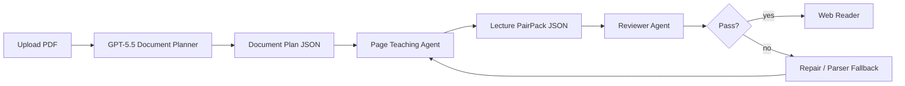
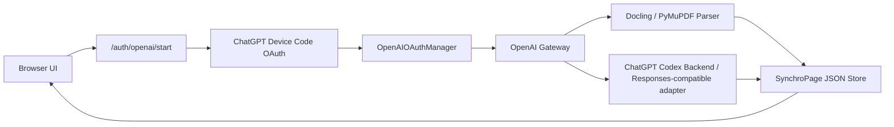

# 最优方案：OpenAI Gateway + 双栏 SynchroPage

## 结论

基于调研报告和你的新约束，最优方案应从“生成讲解 PDF/PPT”调整为：

**GPT-5.5 direct PDF understanding + OpenAI Gateway + deterministic SynchroPage Agent workflow + Web 双栏阅读器**

这个方案保留报告里最关键的页级可控性，同时升级模型入口：GPT-5.5 作为主模型直接读取 PDF，Docling/PyMuPDF/MinerU 作为稳定性、缓存和疑难页面兜底。输出从静态文件改成可交互页面：左侧显示原 PDF 当前页，右侧显示该页讲解、概念、图表解释、置信度和结构化 JSON。讲解不再二次生成 PDF，主产物改为可版本化、可编辑、可回放的 `lecture_pairpack.v1.json`。

## 为什么选它

1. **页级对齐最稳**：每一页都有独立 `page_no`、源 PDF 页、解析文本或模型 evidence、讲解结果和生成状态，方便定位问题。
2. **前端体验最好**：讲解和原文直接左右对照，适合学习、校对、二次编辑，不需要下载一个新的讲解 PDF。
3. **适配 OpenAI 入口**：模型调用统一进入后端 OpenAI Gateway，前端不暴露任何 API key。
4. **Agent 框架稳定**：Document Planner、Page Teaching、Reviewer、Repair 分层运行，失败页面可单独重跑。
5. **后续扩展空间大**：可以继续加 OCR、批处理、缓存、TTS、导出 Markdown/PPTX，但核心数据结构不用推倒重来。

## Agent 主流程



详细框架见 [docs/architecture/course-pdf-agent-framework.md](/Users/harry/SynchroPage/docs/architecture/course-pdf-agent-framework.md)，可配置 prompt 见 [config/prompts/course_agent.prompt.yaml](/Users/harry/SynchroPage/config/prompts/course_agent.prompt.yaml)，输出 schema 见 [contracts/schemas/lecture_pairpack/v1.schema.json](/Users/harry/SynchroPage/contracts/schemas/lecture_pairpack/v1.schema.json)。

## OpenAI OAuth 的落点

基于 `/Users/harry/cc-switch` 的调研，本项目已迁移最小可用的 ChatGPT Device Code OAuth manager。它不是本地 callback 流程，而是后端启动 device code、前端打开 ChatGPT 授权页、后端轮询并换取 token。安全边界保持不变：浏览器不接触模型 token，模型请求统一从后端 OpenAI Gateway 发出。

因此这里推荐的认证结构是：



前端只拿应用会话和 device code。`~/.pdf_agent/openai_oauth.json` 只保存 refresh token；access token 只在内存里，由 `OpenAIOAuthManager` 到期前刷新。模型侧所有调用都经过 `OpenAI Gateway`，这样后续无论是 API key、企业凭据、ChatGPT App OAuth，还是 OpenAI-compatible 网关，都只需要替换后端 adapter。

已落地文件：

- [docs/architecture/openai-oauth-gateway.md](/Users/harry/SynchroPage/docs/architecture/openai-oauth-gateway.md)
- [src/pdf_agent/auth/openai_oauth.py](/Users/harry/SynchroPage/src/pdf_agent/auth/openai_oauth.py)
- [src/pdf_agent/auth/api.py](/Users/harry/SynchroPage/src/pdf_agent/auth/api.py)
- [src/pdf_agent/gateway/openai_gateway.py](/Users/harry/SynchroPage/src/pdf_agent/gateway/openai_gateway.py)
- [config/auth/openai_oauth.yaml](/Users/harry/SynchroPage/config/auth/openai_oauth.yaml)

相关官方资料入口：

- OpenAI API Authentication：<https://developers.openai.com/api/reference/overview#authentication>
- Latest model guidance：<https://developers.openai.com/api/docs/guides/latest-model.md>
- PDF file input：<https://developers.openai.com/api/docs/guides/pdf-files>
- OpenAI Responses API：<https://developers.openai.com/api/reference/resources/responses/methods/create>
- Structured Outputs：<https://developers.openai.com/api/docs/guides/structured-outputs>
- Apps SDK reference：<https://developers.openai.com/apps-sdk/reference>

## 推荐展示格式

主格式选：

**`lecture_pairpack.v1.json` + Markdown 渲染**

示例结构：

```json
{
  "schema": "lecture_pairpack.v1",
  "document": {
    "id": "doc_001",
    "title": "课程 PDF",
    "source_pdf_url": "/files/doc_001/source.pdf",
    "page_count": 42
  },
  "pages": [
    {
      "page_no": 1,
      "source": {
        "pdf_page_ref": "#page=1",
        "text_md": "本页解析文本...",
        "ocr_used": false,
        "parser": "docling"
      },
      "teaching": {
        "slide_title": "课程导入",
        "speaker_notes_md": "这一页主要建立课程背景...",
        "concepts": ["课程目标", "学习路径"],
        "visual_explanations": ["右侧流程图展示章节关系。"],
        "confidence": 0.91
      },
      "status": "ready"
    }
  ]
}
```

这个格式比 PDF 更适合做产品：可局部重跑、可 diff、可缓存、可编辑、可导出 Markdown，也能在需要时再生成 PPTX speaker notes。

## 最小 API 形态

```http
POST /auth/openai/start
POST /auth/openai/poll
GET  /auth/openai/status
POST /auth/openai/logout
POST /api/documents
GET  /api/documents/:document_id
GET  /api/documents/:document_id/pages/:page_no
POST /api/documents/:document_id/generate
GET  /api/jobs/:job_id/events
PATCH /api/documents/:document_id/pages/:page_no/teaching
GET  /api/documents/:document_id/export?format=json|markdown
```

生成策略：

- 10 页以内：在线同步或短轮询。
- 10 页以上：异步任务 + SSE 进度。
- 离线批量：OpenAI Batch API。
- 解析缓存：`file_sha256 + parser_version`。
- 页级缓存：`page_hash + model + prompt_version`。
- 摘要缓存：`doc_hash + summary_prompt_version`。

## 前端布局

前端第一屏就是工作台，不做营销页：

- 左侧窄栏：页码、状态、置信度、搜索。
- 中间：原 PDF 当前页。
- 右侧：讲解 Markdown、概念、图表说明、JSON tab。
- 顶部：OpenAI OAuth 入口、上传 PDF、导入/导出 JSON、生成按钮。

当前仓库中的 `apps/web/` 是自包含的 React/TypeScript SynchroPage，右侧 Agent Panel 基于 `@assistant-ui/react`。前端自己的 `package.json`、`tsconfig*.json` 和 `vite.config.ts` 都放在 `apps/web/`，运行时先构建到 `apps/web/dist`，再由 `pdf_agent.server.web_app` 提供静态资源、OAuth 路由和 `/api/agent/chat` 后端代理：

```bash
./scripts/run-web.sh --port 8765
```

开发模式下可同时运行 Python backend 和 Vite dev server，Vite 会将 `/api`、`/auth` 代理到本地后端。
